# CPSC449-MidtermProject

This project is a backend API for an Event Ticketing System,
similar in concept to Ticketmaster or Eventbrite. The system allows
organizers to create events, the venues where they are held, manage different
types of tickets, and allow attendees to book tickets. The system manages:  
* Organizers: Create and manage events.
* Venues: Locations with limited capacity.
* Events: Held at a venue, hosted by organizer, with multiple ticket types.
* Ticket Types: Different types of ticket (e.g., VIP, Student, and General Admission) with prices and availability.
* Attendees: Users who register and book tickets.
* Bookings: Records ticket purchases, payment status, and booking references.
## Team Members:
Cesar Carrillo&nbsp;&nbsp;&nbsp;&nbsp;&nbsp;819760794  
Vanessa Ragan&nbsp;&nbsp;&nbsp;&nbsp;&nbsp;888419215  
Hunter Tran&nbsp;&nbsp;&nbsp;&nbsp;&nbsp;886474907
## API Endpoints
### POST /api/organizers
Creates a new organizer.  
#### Request:
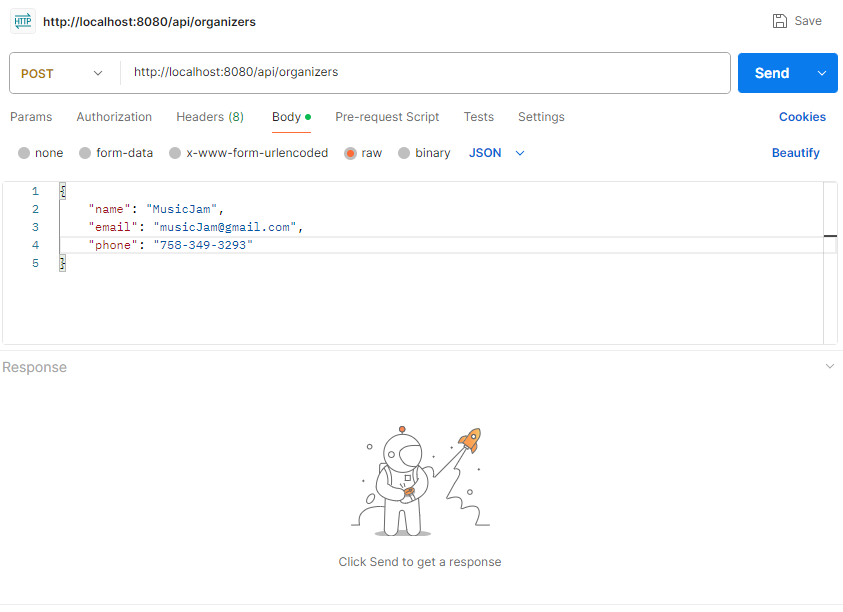
#### Response:
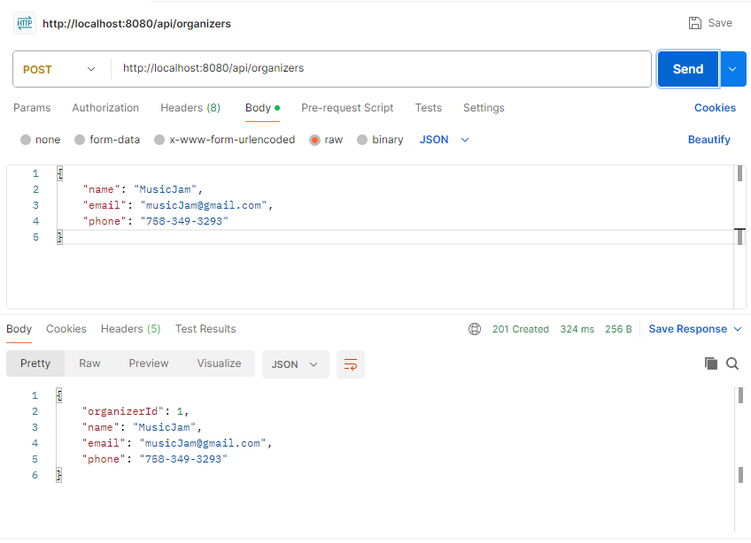
***
### POST /api/venues
Creates a new venue.  
#### Request:
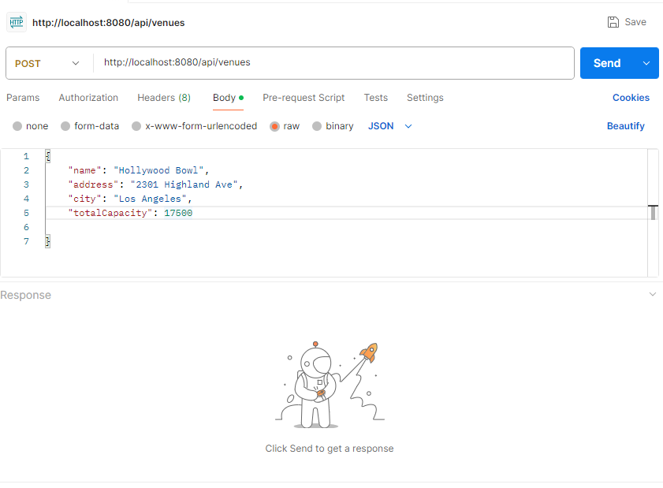
#### Response:
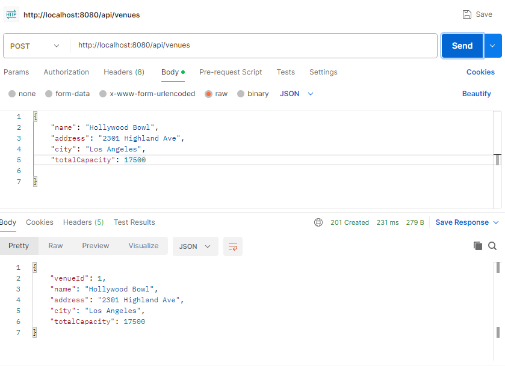
***
### POST /api/events
Creates a new event.  
#### Request:
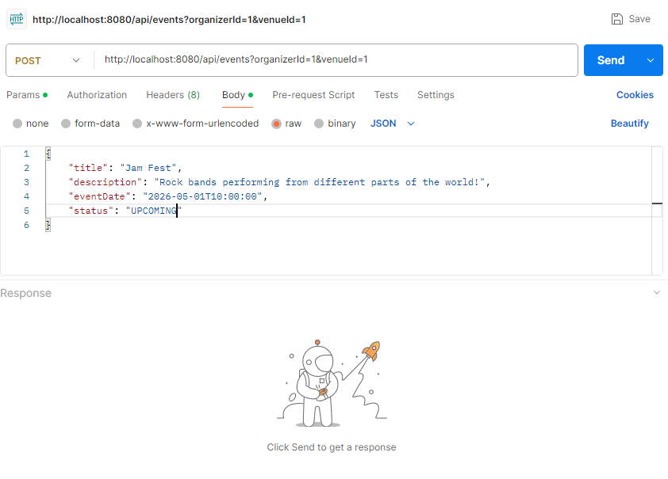
#### Response:
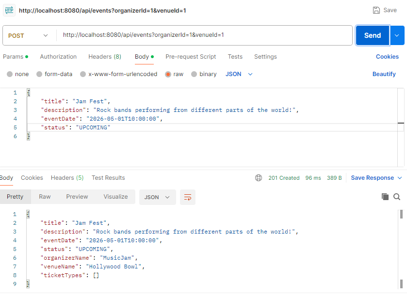
***
### GET /api/events
List of all upcoming events.  
#### Request:
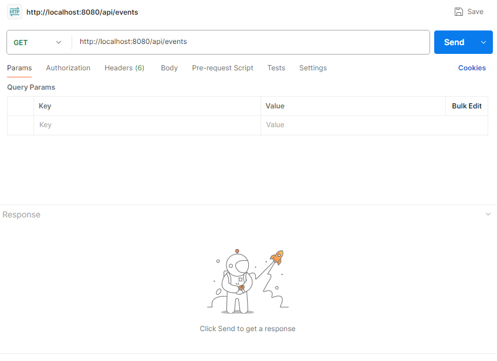
#### Response:
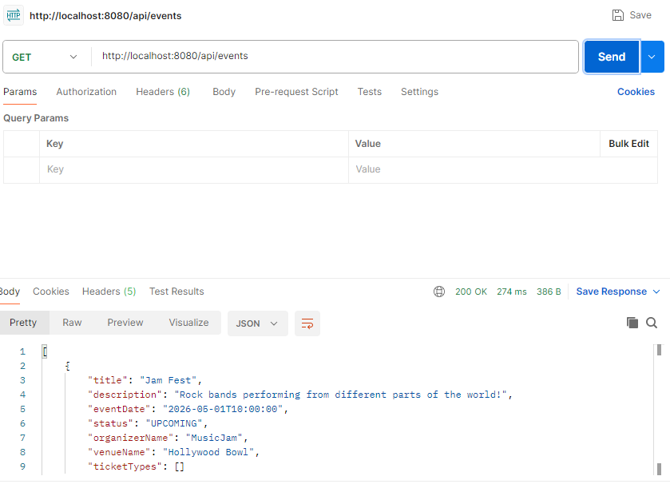
***
### GET /api/events/{id}
Gets event details with ticket types.
#### Request:

#### Response:
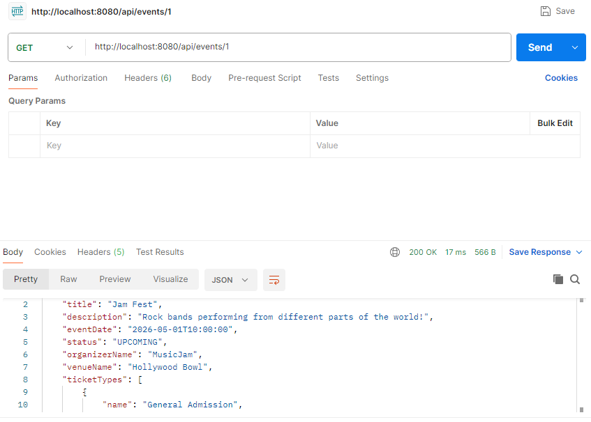
***
### POST /api/attendees
Registers a new attendee.  
#### Request:
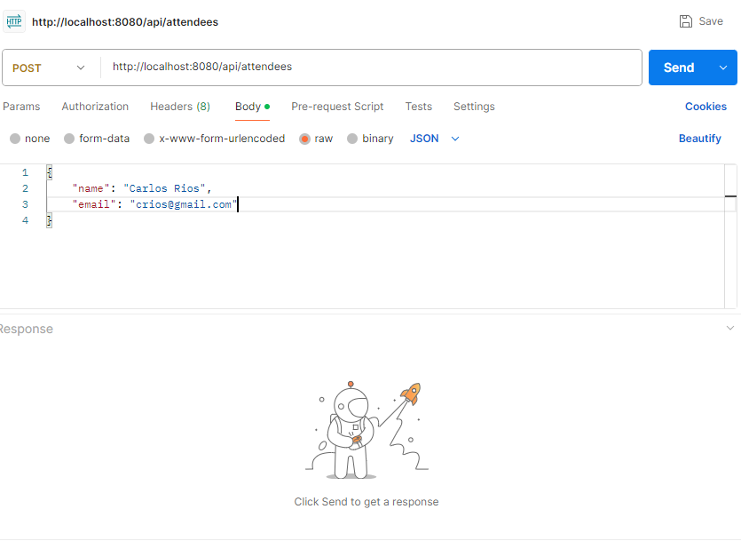
#### Response:
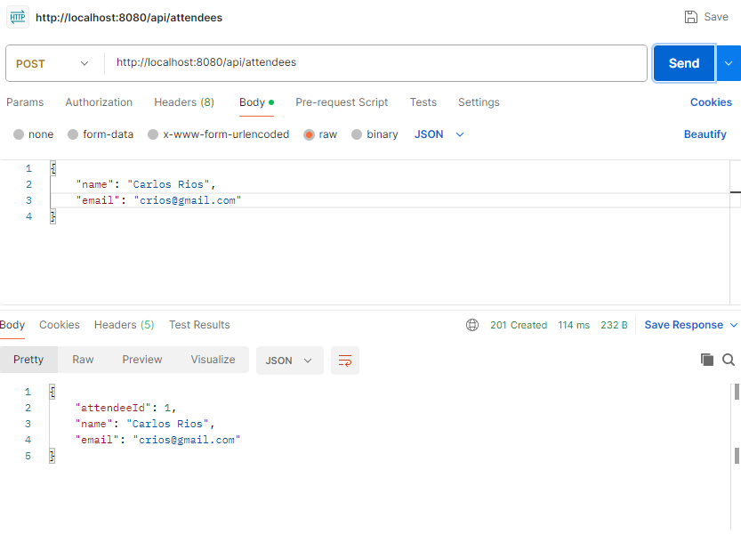
***
### POST /api/bookings
Books a ticket.  
#### Request:
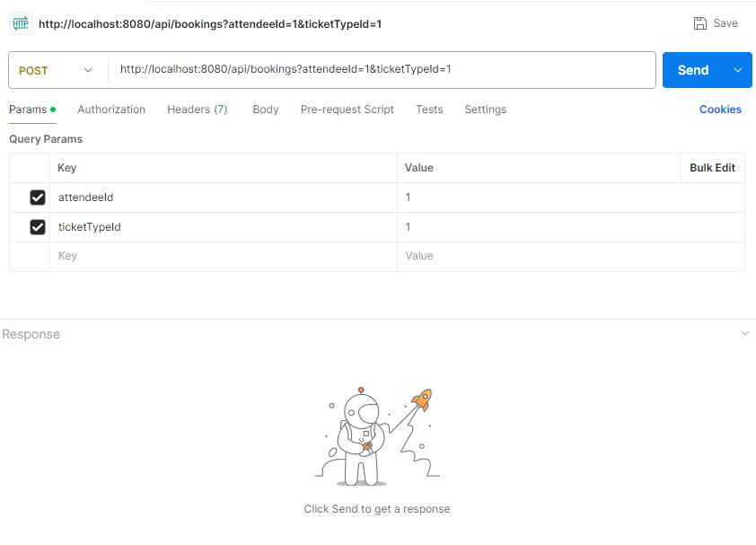
#### Response:
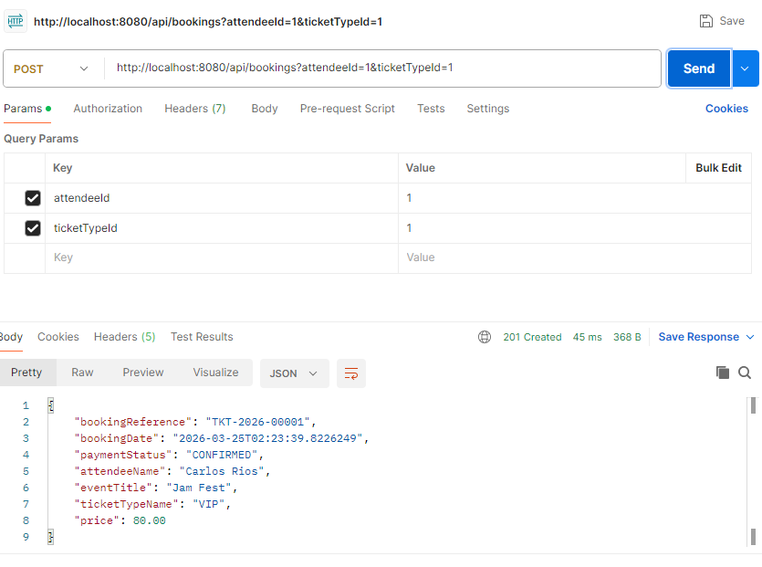
***
### PUT /api/bookings/{id}/cancel
Cancels a booking.  
#### Request:
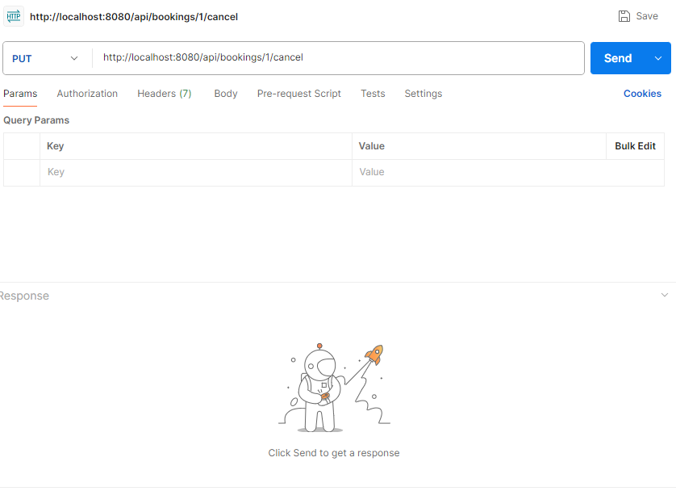
#### Response:
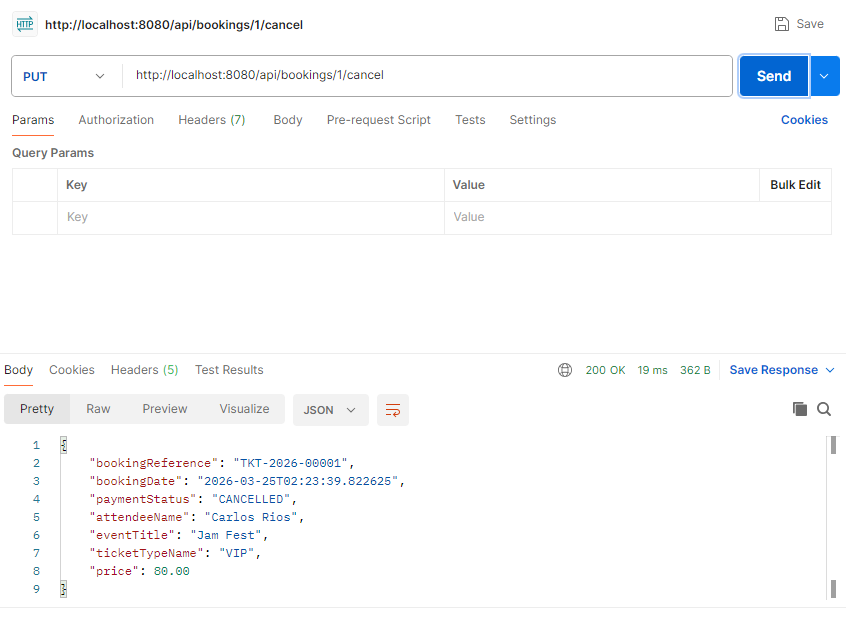
***
### GET /api/events/{id}/revenue
Gets total confirmed revenue for an event.  
#### Request:

#### Response:
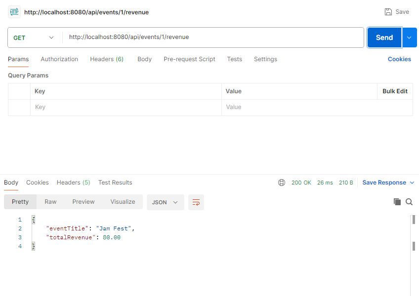
***
### GET /api/attendees/{id}/bookings
Gets all bookings for an attendee.  
#### Request:
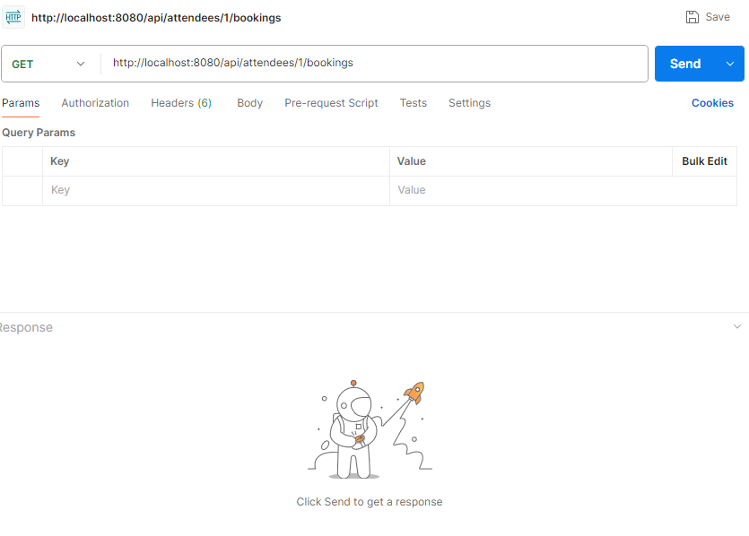
#### Response:
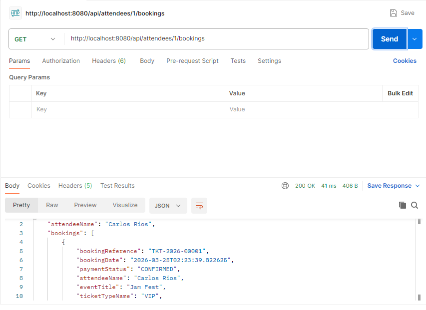
***
### POST /api/ticket-types (optional)
Creates a ticket type for an event.
#### Request:
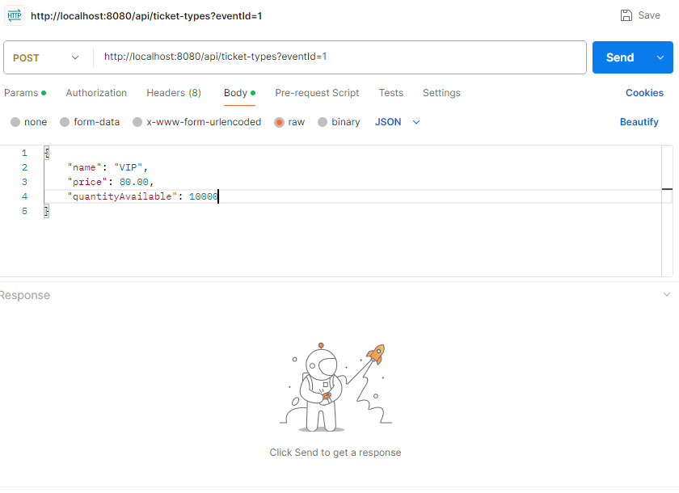
#### Response:
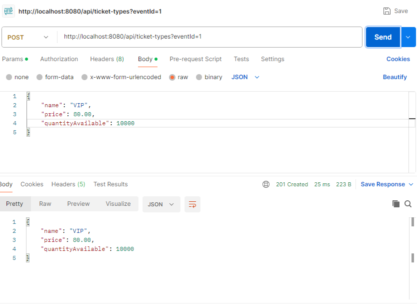
***

